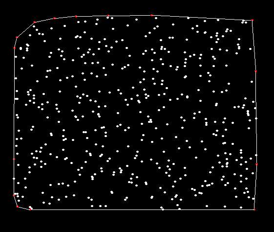
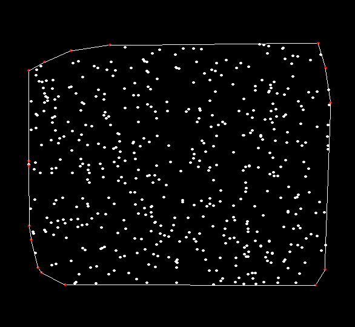

# Convex-hull
Convex hull program that wraps a set of points using Jarvis March algorithm. This is a basic algorithm people learn when they venture into Computational geometry. This also introduces the concepts of CCW and CW.

 | 
